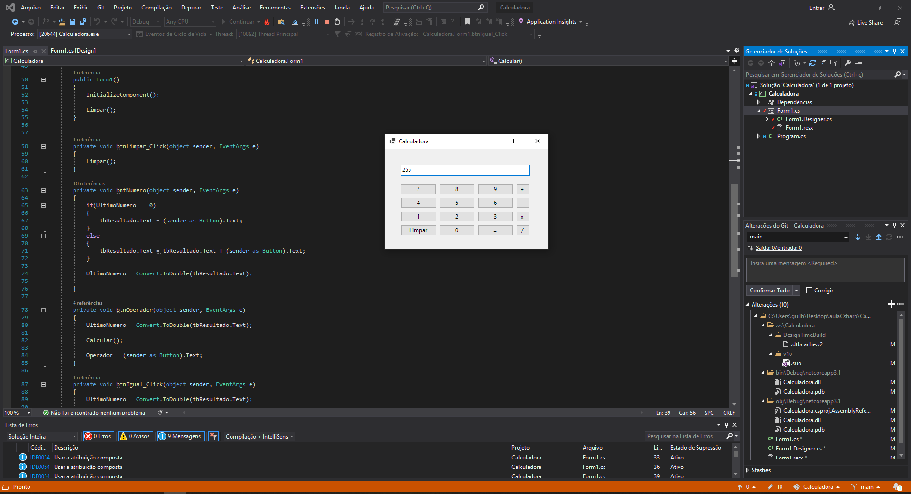

## Calculadora

Exercícios dos estudos de C#. 

Primeiro Projeto C#, criado do zero.. =)  

Durante esse exercício pude compreender melhor a criação de Classes e Métodos, junto com suas vantagens. 
Na execução do código renderiza uma calculadora simples, com as operações básicas, para consolidar o aprendizado das primeiras aulas 

## Print da Execução

